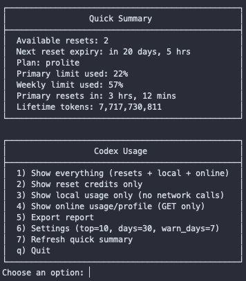
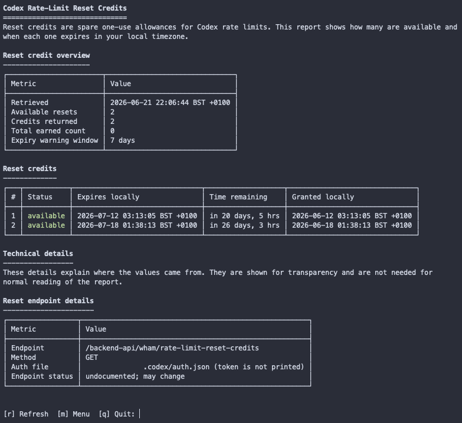
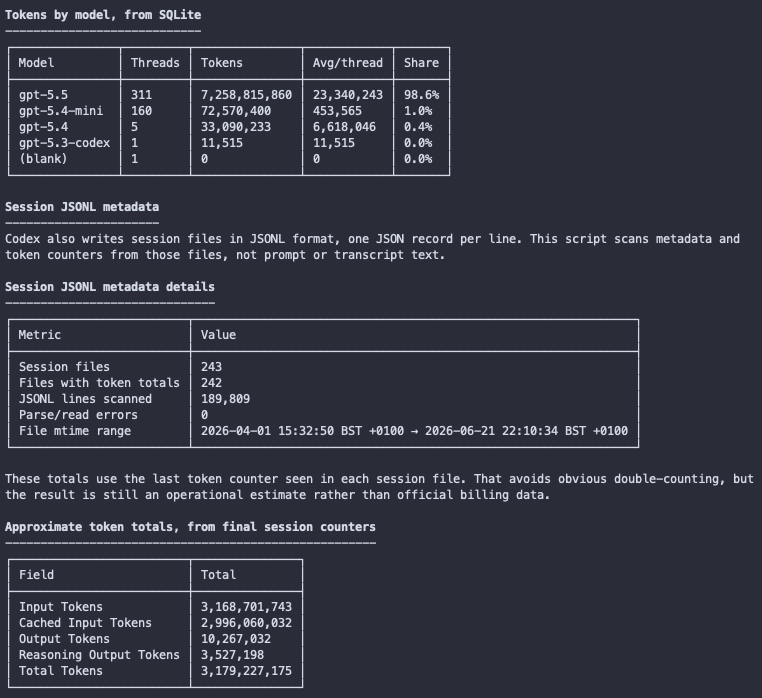
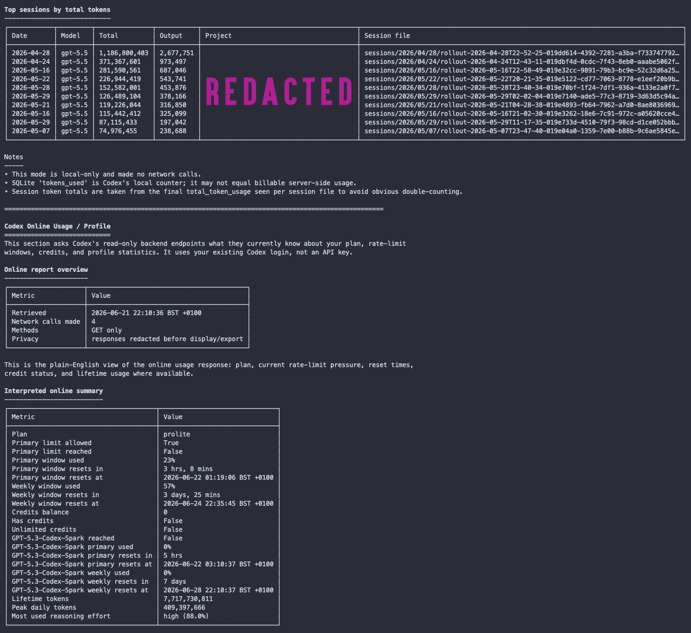
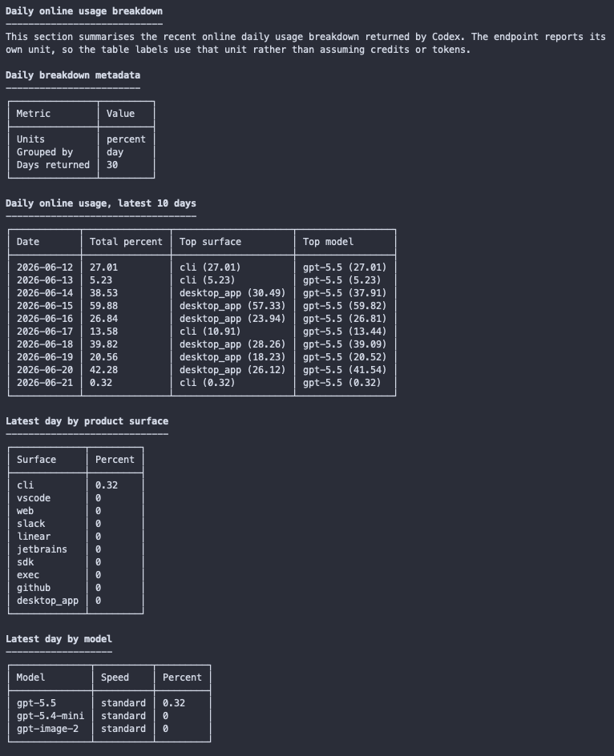
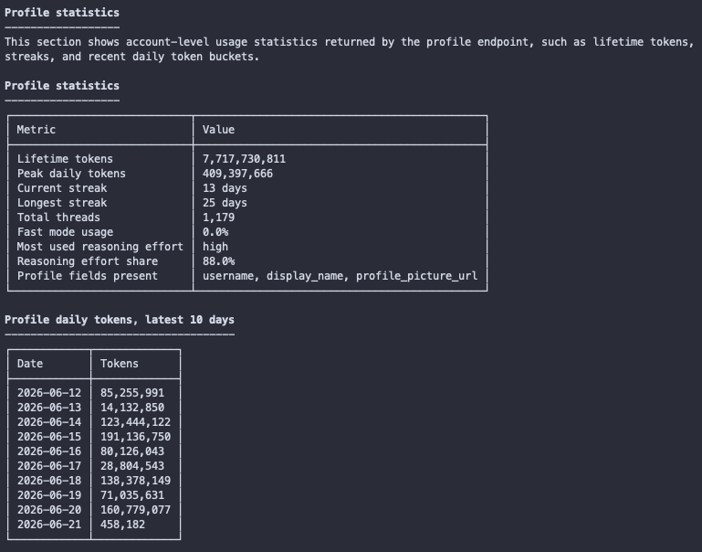

# Codex Usage

Codex Usage is a local command-line tool for people who want a clear view of their Codex reset credits, rate-limit windows, local usage metadata, read-only online usage/profile data and optional OpenAI API organisation usage.

The project is intentionally small: one Python file, no package install and no third-party Python dependencies. The core Codex reports do not need an OpenAI API key. The optional `api-usage` report uses `OPENAI_ADMIN_KEY` when you choose that report.

Use it to see how many reset credits are available, when they expire in your local timezone, whether visible rate-limit windows are close to their limit, what local Codex metadata says about sessions, models, days and token totals, and what the OpenAI Admin API reports for organisation API usage and costs. You can export the same reports as TXT, JSON or CSV files beside the script.

This is not an official OpenAI or Codex tool. It does not redeem credits, buy credits, change your Codex or ChatGPT account, change Codex settings, or upload local transcripts. The Codex online data comes from undocumented ChatGPT/Codex backend endpoints, so treat it as useful operational information rather than a contractual billing statement. The optional `api-usage` report uses documented OpenAI Admin API endpoints for API organisation usage and costs; it is not ChatGPT or Codex subscription billing.

## Requirements

- Python 3.10 or newer.
- macOS, Linux or Windows.
- Local Codex state under your Codex home directory for `local-usage`.
- A Codex login at `auth.json` inside your Codex home directory and network access for `resets`, `online-usage`, `all` and menu quick summaries.
- `OPENAI_ADMIN_KEY` with suitable organisation permissions for the optional `api-usage` report.

No third-party Python packages are required. By default, Codex Usage reads Codex data from `Path.home() / ".codex"`. Set `CODEX_HOME` to use a different Codex home directory.

The source layout is deliberately small:

```text
.gitattributes
codex_usage.py
img/
LICENCE
README.md
```

## Install And Run

Download or clone this repository, then open a terminal in the folder that contains `codex_usage.py`.

Make the script executable and start it:

```sh
chmod +x codex_usage.py
./codex_usage.py
```

If you prefer not to mark the file executable, run it through Python:

```sh
python3 codex_usage.py
```

On Windows, open PowerShell in the folder that contains `codex_usage.py`, then run the script with the Python launcher:

```powershell
py -3 .\codex_usage.py
py -3 .\codex_usage.py local-usage
```

You can check the script syntax before running it:

```sh
python3 -m py_compile ./codex_usage.py
```

PowerShell equivalent:

```powershell
py -3 -m py_compile .\codex_usage.py
```

The syntax check only verifies that Python can parse the script. It does not contact Codex and does not read your account data.

If your Codex data is not in the default user-profile `.codex` directory, set `CODEX_HOME` before running the script:

```sh
CODEX_HOME="/path/to/codex-home" ./codex_usage.py local-usage
```

PowerShell equivalent:

```powershell
$env:CODEX_HOME = "C:\Users\you\.codex"
py -3 .\codex_usage.py local-usage
```

## Use The Reports

In an interactive terminal, running the script without arguments opens the menu. In non-interactive use, the same entry point prints the `all` report.

```sh
./codex_usage.py
```

The menu starts with a quick summary, then offers the report choices and settings:

```text
1) Show everything (resets + local + online)
2) Show reset credits only
3) Show local usage only (no network calls)
4) Show online usage/profile (GET only)
5) Show OpenAI API usage/costs (Admin key)
6) Export report
7) Settings (top=10, days=30, warn_days=7)
8) Refresh quick summary
q) Quit
```

Reports are written for normal reading first. Each major section starts with a short explanation, then shows the main values in labelled tables. Endpoint paths, response shapes and filtered raw fields are collected under `Technical details` near the bottom, so they are available when you need to verify where a value came from without dominating the main report.

You can also call each report directly. Every command supports `-h` and `--help`, and subcommands have their own help:

```sh
./codex_usage.py --help
./codex_usage.py local-usage --help
./codex_usage.py export --help
```

Show everything:

```sh
./codex_usage.py all
```

Show reset credits:

```sh
./codex_usage.py resets
./codex_usage.py resets --warn-days 14
```

Show local usage without network calls:

```sh
./codex_usage.py local-usage
./codex_usage.py local-usage --top 20 --days 60
```

Show read-only online usage/profile data:

```sh
./codex_usage.py online-usage
./codex_usage.py online-usage --top 3
```

Show optional OpenAI API organisation usage and costs:

```sh
export OPENAI_ADMIN_KEY="your-admin-key"
./codex_usage.py api-usage
./codex_usage.py api-usage --days 30 --top 10 --json
./codex_usage.py api-usage --group-by model --group-by project_id
./codex_usage.py api-usage --no-costs
```

`api-usage` calls the OpenAI Admin API, not the Codex or ChatGPT backend endpoints. It reads `OPENAI_ADMIN_KEY` from the environment only; there is no CLI flag for the key.

Set the Admin key only when you use `api-usage`. For a single run, prefix the command:

```sh
OPENAI_ADMIN_KEY="your-admin-key" ./codex_usage.py api-usage
```

That short form can be saved in shell history. To avoid putting the key on the command line, enter it into the current terminal session without echoing it, run the report, then remove it from the session:

```sh
printf "OPENAI_ADMIN_KEY: "
read -rs OPENAI_ADMIN_KEY
printf "\n"
export OPENAI_ADMIN_KEY
./codex_usage.py api-usage
unset OPENAI_ADMIN_KEY
```

For the current terminal session, the script only needs `OPENAI_ADMIN_KEY` to be exported before it starts. For regular use, load the value from your operating system's secret manager before you start the script, or export it from your shell profile, such as `~/.zshrc` or `~/.bashrc`. If you store it in a shell profile, treat that file as a credential. Do not put the key in this repository, screenshots, issues, commits, report exports, or `<Codex home>/auth.json`.

For copy/paste-friendly output, scripted checks or logs, disable terminal colour:

```sh
./codex_usage.py local-usage --top 1 --days 1 --no-colour
./codex_usage.py online-usage --top 3 --no-colour
./codex_usage.py resets --no-colour
```

For automation, print machine-readable JSON instead of prose and tables:

```sh
./codex_usage.py all --json
./codex_usage.py resets --json
./codex_usage.py local-usage --json
./codex_usage.py online-usage --json
./codex_usage.py api-usage --json
```

## Screenshots

<!-- markdownlint-disable MD033 -- HTML is used here so GitHub can render bounded thumbnails that link to the full-size screenshots. -->
<p>
  <a href="https://github.com/MacSteini/Codex-Usage/blob/main/img/1.png"></a>
  <a href="https://github.com/MacSteini/Codex-Usage/blob/main/img/2.png"></a>
  <a href="https://github.com/MacSteini/Codex-Usage/blob/main/img/3.png"></a>
  <a href="https://github.com/MacSteini/Codex-Usage/blob/main/img/4.png"></a>
  <a href="https://github.com/MacSteini/Codex-Usage/blob/main/img/5.png"></a>
  <a href="https://github.com/MacSteini/Codex-Usage/blob/main/img/6.png"></a>
</p>
<!-- markdownlint-enable MD033 -->

## Command Reference

| Command | What it does | Network calls |
| --- | --- | --- |
| `./codex_usage.py` | Opens the menu in an interactive terminal; prints `all` in non-interactive use. | Depends on mode |
| `./codex_usage.py menu` | Opens the interactive menu explicitly. | Yes, for the quick summary and online reports |
| `./codex_usage.py all` | Shows reset credits, local usage and online usage/profile. | Yes |
| `./codex_usage.py resets` | Shows reset-credit count and expiry. | Yes |
| `./codex_usage.py local-usage` | Shows local Codex metadata and counters only. | No |
| `./codex_usage.py online-usage` | Shows read-only online usage/profile data. | Yes |
| `./codex_usage.py api-usage` | Shows optional OpenAI API organisation usage and costs using `OPENAI_ADMIN_KEY`. | Yes |
| `./codex_usage.py export` | Writes a report beside the script. | Depends on `--report` |

Shared display switches:

| Switch | Available on | Meaning | Default |
| --- | --- | --- | --- |
| `-h`, `--help` | All commands | Show help and exit. | n/a |
| `--colour {auto,always,never}` / `--color {auto,always,never}` | All subcommands | Control terminal colour output. | `auto` |
| `--no-colour` / `--no-color` | All subcommands | Disable colour output. Useful for logs and copied output. | off |
| `--json` | `all`, `resets`, `local-usage`, `online-usage`, `api-usage` | Print machine-readable JSON instead of prose/tables. | off |
| `--top N` | `all`, `menu`, `local-usage`, `online-usage`, `api-usage`, `export` | Limit ranked rows and Technical details field samples. | `10` for `all`, `menu`, `local-usage`, `api-usage` and `export`; `30` for direct `online-usage` |
| `--days N` | `all`, `menu`, `local-usage`, `api-usage`, `export` | Number of recent days to show/include. For `api-usage`, this controls the Admin API query window. | `30` |
| `--warn-days N` | `all`, `menu`, `resets`, `export` | Warn when reset credits expire within this many days. Use `0` to disable soon-expiry warnings. | `7` |

`api-usage` also supports:

| Switch | Meaning | Default |
| --- | --- | --- |
| `--bucket-width {1d,1h,1m}` | OpenAI usage bucket width. Costs are available only with `1d`; other widths skip costs. | `1d` |
| `--limit N` | Override the number of buckets requested from the Admin API. | derived from `--days` and `--bucket-width` |
| `--group-by FIELD` | Group rows by `project_id`, `user_id`, `api_key_id`, `model`, `batch`, `service_tier` or `line_item`. Repeat for multiple fields. Unsupported fields for a specific endpoint are ignored with a note. | none |
| `--no-costs` | Skip the OpenAI costs endpoint and request completions usage only. | off |

The menu and commands use the same display settings. `top` controls ranked-table length, such as top sessions or model usage. `days` controls how many recent calendar days appear in daily local-usage tables. `warn_days` controls how soon reset-credit expiry should produce a warning; use `0` to disable soon-expiry warnings. These settings affect display and export size only. They do not change Codex, your account, your Codex home directory or any server setting.

## Exports

Use `export` when you want to save a report beside the script:

```sh
./codex_usage.py export --report all --format txt
./codex_usage.py export --report all --format json
./codex_usage.py export --report all --format csv
```

You can export a single report type:

```sh
./codex_usage.py export --report resets --format txt
./codex_usage.py export --report local-usage --format csv
./codex_usage.py export --report online-usage --format json
./codex_usage.py export --report api-usage --format csv
```

Export-only switches:

| Switch | Meaning | Default |
| --- | --- | --- |
| `--report {all,resets,local-usage,online-usage,api-usage}` | Chooses which report to save. | `all` |
| `--format {txt,json,csv}` | Chooses the export format. | `txt` |

When `--report api-usage` is selected, the export command also accepts `--bucket-width`, `--limit`, `--group-by` and `--no-costs`.

Reports are written to the same directory as `codex_usage.py`. If the script is on your Desktop, reports are written to your Desktop. If the script is in a cloned repository, reports are written inside that repository directory.

Report names look like this:

```text
codex_all_report_2026-06-20_114005.txt
codex_resets_report_2026-06-20_114005.json
codex_online-usage_report_2026-06-20_114005.csv
codex_api-usage_report_2026-06-20_114005.csv
```

The script never removes exported reports. If you export inside a Git checkout, check `git status` before committing and keep generated `codex_*_report_*` files out of the source release.

## Privacy And Authentication

Codex Usage reuses your existing Codex login file:

```text
<Codex home>/auth.json
```

The Codex home directory is `Path.home() / ".codex"` unless `CODEX_HOME` is set. With the default location, macOS and Linux users still use `~/.codex/auth.json`; Windows users use the equivalent `.codex\auth.json` under their user profile.

The script reads the access token and account ID from that file when it calls Codex/ChatGPT backend endpoints. It does not print them, and the core reports do not need an OpenAI API key.

Online responses are redacted before display or export. Token-like and identity-like fields are filtered by sensitive field name, including access tokens, refresh tokens, ID tokens, authorisation headers, cookies, session values, account IDs, email fields, phone fields, passwords and secrets. Email addresses inside string values are also redacted.

Local usage mode reads metadata and counters from your Codex home directory. It avoids prompt text, assistant text, command text, diffs, transcripts and secret contents.

The optional `api-usage` report reads `OPENAI_ADMIN_KEY` from the environment. It does not accept the key as a command-line argument, does not read it from `<Codex home>/auth.json`, and does not print or export it. API key IDs, organisation IDs, project IDs and user IDs are shortened before display or export. Do not include real Admin keys, raw billing responses or private account identifiers in issues, screenshots, fixtures or commits.

## Network Behaviour

Local usage mode makes no network calls:

```sh
./codex_usage.py local-usage
```

Reset and online usage modes call undocumented ChatGPT/Codex backend endpoints with read-only `GET` requests. The script uses them for reset credits, rate-limit and usage summaries, daily token breakdowns, credit events and profile metadata. These endpoints may change without notice. Treat their output as operational information that helps you understand the current account state visible to those endpoints, not as an official billing source.

`api-usage` calls documented OpenAI Admin API `GET` endpoints for organisation completions usage and costs. It requires `OPENAI_ADMIN_KEY` and suitable Admin API permissions. Missing keys, insufficient permissions, rate limits, timeouts, network errors and invalid JSON are reported in the `api-usage` output without changing the behaviour of the keyless Codex reports.

## Accuracy

The Codex Desktop app can show slightly different limit figures from this script. That is normally not a sign that reset credits are wrong. The app may use additional internal endpoints or frontend-specific calculations, group primary, weekly, promotional, model-specific or additional-rate-limit buckets differently, or refresh values at a different time.

For reset-credit count and expiry, use the reset-credit report. For rate-limit pressure, treat Codex Usage as a transparent read-out of the backend fields it can see, including `rate_limit` and `additional_rate_limits`, rather than a clone of the Desktop UI.

Local token counters are local Codex counters. They are useful for spotting patterns and large sessions, but they may not match server-side accounting. Online usage data is useful operational data, not official billing documentation and not guaranteed to match the Desktop app's presentation.

OpenAI API usage and costs are separate from ChatGPT and Codex subscription usage. Use `api-usage` for organisation API activity reported by the OpenAI Admin API, and use the other reports for Codex reset credits, local metadata and visible Codex backend state.

## Troubleshooting

If the script fails before running, first check that Python can parse it:

```sh
python3 -m py_compile ./codex_usage.py
```

If `./codex_usage.py` says permission is denied, make it executable:

```sh
chmod +x codex_usage.py
```

If the script says `<Codex home>/auth.json` is missing or malformed, sign in to Codex first, then run the script again. Codex Usage reuses that existing login; the core reports do not ask for, store or need an OpenAI API key.

By default, `<Codex home>` is `Path.home() / ".codex"`, so the default auth file remains `~/.codex/auth.json` on macOS/Linux and the equivalent `.codex\auth.json` directory under the user profile on Windows. If your Codex data is stored somewhere else, set `CODEX_HOME` to that directory before running the script.

If `api-usage` says `OPENAI_ADMIN_KEY` is missing, set it for one run or for your current shell session, then run the command again:

```sh
OPENAI_ADMIN_KEY="your-admin-key" ./codex_usage.py api-usage

# Or for the current terminal session:
export OPENAI_ADMIN_KEY="your-admin-key"
./codex_usage.py api-usage
```

If `api-usage` returns 401 or 403, check that the key is an OpenAI Admin API key with access to the organisation usage and costs endpoints. If it returns 429, reduce the request frequency or wait before retrying. If costs are skipped with `--bucket-width 1h` or `--bucket-width 1m`, use the default `1d` bucket width or pass `--no-costs`.

If online sections fail but `local-usage` works, the likely causes are network access, an expired Codex login, or undocumented backend endpoints changing. You can still run the local-only report without network access:

```sh
./codex_usage.py local-usage
```

For copy/paste-friendly output, disable colour:

```sh
./codex_usage.py all --no-colour
```

For automation, use JSON output on non-export report commands:

```sh
./codex_usage.py all --json
```

If a numeric option is invalid, the script exits before making requests. `--top` and `--days` must be at least `1`; `--warn-days` must be `0` or greater.

## Contributing

Bug reports, focused fixes and documentation improvements are welcome.

Keep changes narrow and include the checks that match the touched area. For README-only changes, run the repository validation. For script changes, also run the relevant `--help` command, syntax check and Python lint checks:

```sh
python3 -m py_compile ./codex_usage.py
ruff check ./codex_usage.py
ruff format --check ./codex_usage.py
pyflakes ./codex_usage.py
python3 codex_usage.py --help
```

Do not include access tokens, `<Codex home>/auth.json`, exported reports, raw backend responses, local transcripts, private prompts, private paths or account data in issues, commits, fixtures or screenshots.

Do not include `OPENAI_ADMIN_KEY`, raw Admin API billing responses, API key IDs, organisation IDs, project IDs or user IDs in issues, commits, fixtures or screenshots.

Please report security or privacy issues privately instead of publishing exploit details.

## Licence

This project uses the MIT Licence. See [LICENCE](LICENCE).
