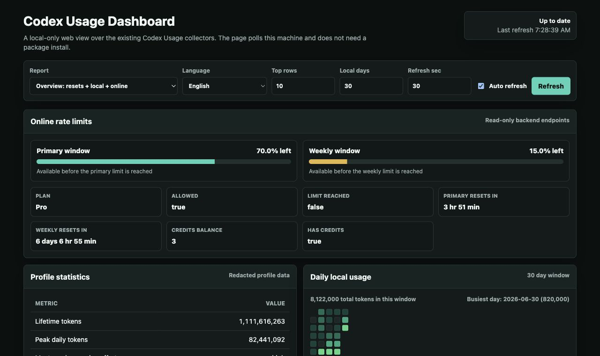
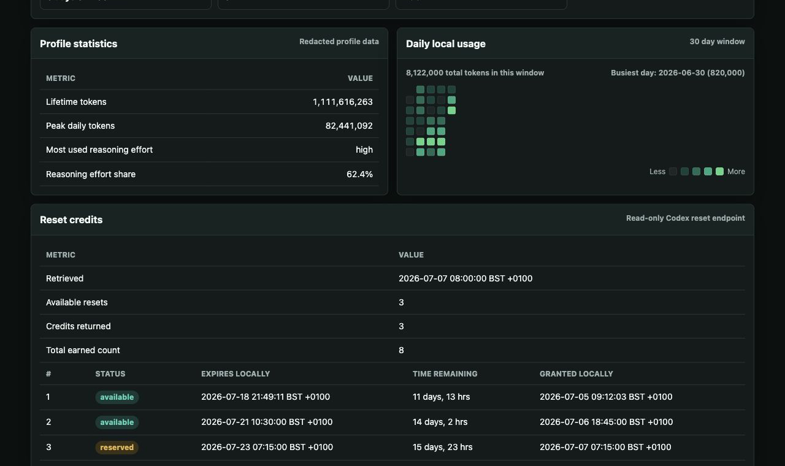
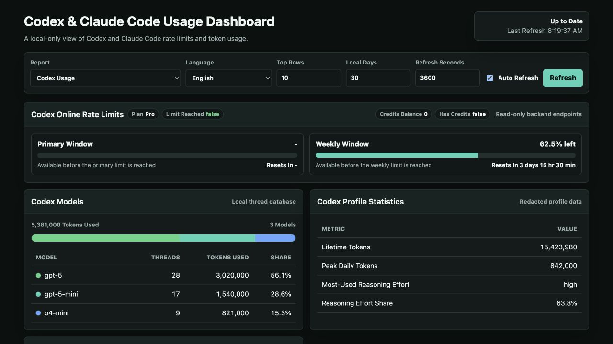
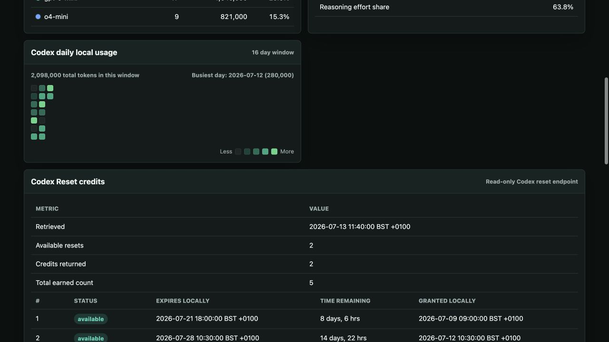
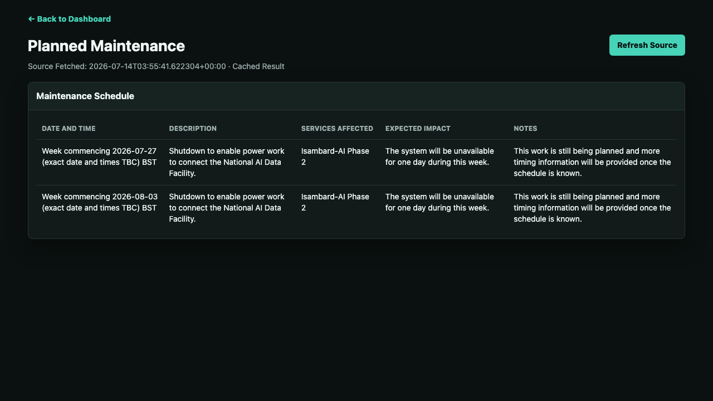
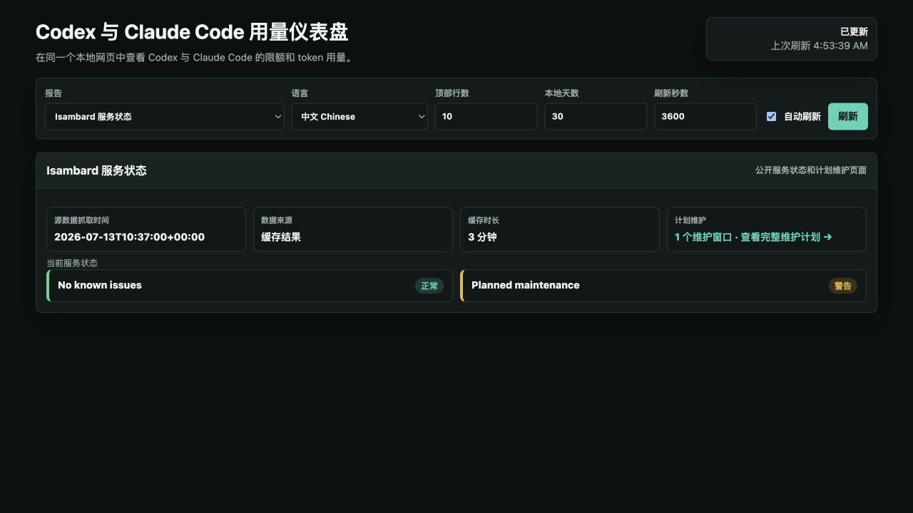

<p align="right">
  <strong>English</strong> | <a href="README.zh-CN.md">中文</a>
</p>

# Codex & Claude Code Usage Dashboard

A local, dependency-free dashboard for viewing Codex, Claude Code, and
Isambard service information in one browser page.

The dashboard combines subscription rate-limit windows, local token history,
model and project breakdowns, daily heatmaps, session rankings, optional
OpenAI Admin API data, and Isambard service status. It runs with the Python
standard library and binds to `127.0.0.1` by default.

> This repository is maintained as an independent project, not as a
> synchronised mirror of its upstream. Its **Codex collection and reporting
> foundation is derived from
> [MacSteini/Codex-Usage](https://github.com/MacSteini/Codex-Usage)**. The
> combined web dashboard, Claude Code support, statusLine bridge, Isambard
> integration, bilingual interface, and related documentation are additions
> developed in this project.

This is not an official OpenAI, Anthropic, Codex, Claude Code, or Isambard
tool.

## Screenshots

Click a thumbnail to open the full-size image. The first five screenshots use
the desktop layout; the last shows the responsive narrow layout.

<!-- markdownlint-disable MD033 -- HTML keeps the screenshot gallery compact on GitHub. -->
<p>
  <a href="img/dashboard/1.png"></a>
  <a href="img/dashboard/2.png"></a>
  <a href="img/dashboard/3.png"></a>
  <a href="img/dashboard/4.png"></a>
  <a href="img/dashboard/5.png"></a>
  <a href="img/dashboard/6.png"></a>
</p>
<!-- markdownlint-enable MD033 -->

## Project Origin and Attribution

The codebase has two clearly separated origins:

| Area | Origin |
| --- | --- |
| `codex_usage.py` and the Codex collection/reporting foundation | Derived from [MacSteini/Codex-Usage](https://github.com/MacSteini/Codex-Usage) and retained as the separate Codex core, with small integration-oriented changes such as a machine-readable retrieval timestamp |
| Codex results displayed in the browser | Powered by the upstream-derived `codex_usage.py` collector and integrated into this project's web interface |
| `codex_claude_usage_web.py` and the combined browser UI | Developed in this project |
| `claude_usage.py`, `claude_usage_statusline.py`, and `claude_usage_refresher.py` | Developed in this project; independent of `codex_usage.py` |
| `isambard_status.py`, bilingual UI, dashboard layout, and integration logic | Developed in this project |

The upstream project is distributed under the MIT License. Its copyright and
license notice remain in [LICENCE](LICENCE), alongside Frederick Zou's
copyright notice for this project's additions. The upstream CLI documentation
is preserved in [README_OLD.md](README_OLD.md).

## Features

- Combined local overview for Codex rate limits, Claude Code rate limits,
  Isambard status, and Codex/Claude model summaries.
- Dedicated Codex and Claude Code detail views.
- English and Chinese interface with the language choice retained locally.
- Compact toolbar with report, language, local-day window, refresh interval,
  auto-refresh, and manual refresh controls.
- Compact panel headings for Codex reset summaries, online-data age, Claude
  snapshot state, model-data age, Isambard cache age, and planned-maintenance
  access. Ages are shown relatively (for example, `Updated <1 min`) when a
  source provides a timestamp.
- Primary/5-hour and weekly/7-day limit bars with reset countdowns.
- Local token totals, model shares, daily heatmaps, and top sessions.
- Claude Code input, output, cache-creation, and cache-read token accounting,
  deduplicated by request/message identity.
- Claude Code model, project, session, and daily breakdowns, including subagent
  JSONL files.
- Optional macOS background refresh for the Claude Code rate-limit snapshot,
  without submitting prompts.
- Optional OpenAI organisation usage and cost data through
  `OPENAI_ADMIN_KEY`.
- Isambard service status and planned maintenance, with a five-minute cache
  and last-known-good fallback.
- Local JSON API for integrations and automation.
- Original Codex command-line reports and TXT/JSON/CSV exports.

## Requirements

- Python 3.10 or newer.
- Local Codex state, normally under `~/.codex`.
- Local Claude Code transcripts under `~/.claude/projects` for Claude token
  history.
- A Codex login in `~/.codex/auth.json` for Codex reset credits and read-only
  online usage/profile data.
- `OPENAI_ADMIN_KEY` only for the optional OpenAI Admin API section.

No package installation or third-party Python dependency is required.
The optional macOS background refresher uses the system-provided
`/usr/bin/expect` and `launchd`.

## Quick Start

From the repository directory, run:

```sh
python3 codex_claude_usage_web.py
```

Open the private access URL printed in the terminal. The first request stores an
`HttpOnly` browser session cookie and redirects to `http://127.0.0.1:8765`, so
the access token is removed from the address bar. Do not share the printed URL.

Stop the server with `Ctrl-C`. Common options are:

```sh
python3 codex_claude_usage_web.py --port 8766
python3 codex_claude_usage_web.py --refresh 30
python3 codex_claude_usage_web.py --quiet
python3 codex_claude_usage_web.py --host 127.0.0.1 --port 8765
```

The default host is deliberately local-only. Requests are restricted to known
Host headers, the data API requires the per-process access capability, and
simultaneous requests and collectors are bounded. A wildcard bind must name an
accepted hostname explicitly, for example
`--host 0.0.0.0 --allowed-host 192.0.2.10`; it may expose the dashboard to other
devices and should be used with care.

## Claude Code Setup

### Local token history

No installation step is required for token history. `claude_usage.py` reads
usage metadata from:

```text
~/.claude/projects/**/*.jsonl
```

Prompt text, response text, tool inputs, and file contents are ignored. Claude
Desktop Code sessions are included when the app writes them to this same
directory.

### Official 5-hour and 7-day windows

To capture the official subscription windows exposed to Claude Code
statusLine scripts, register the included bridge once:

```sh
python3 claude_usage_statusline.py --install
```

After a compatible Claude Code client completes a response, the bridge writes
a sanitised snapshot to:

```text
~/.claude/usage-dashboard.json
```

It stores only rate-limit percentages, reset timestamps, model metadata, and
capture metadata. It does not store prompts or responses. Installation refuses
to replace a different statusLine unless `--force` is explicitly supplied.

Useful commands:

```sh
python3 claude_usage.py
python3 claude_usage.py --json --days 30 --top 10
python3 claude_usage_statusline.py --status
python3 claude_usage_statusline.py --uninstall
```

> Browser auto-refresh only rereads the latest snapshot. Claude Desktop may
> update local JSONL token history without invoking a custom statusLine. In
> that case, token charts continue to change while the 5-hour/7-day snapshot
> becomes stale. The dashboard displays snapshot age and stale state so an old
> value is not mistaken for live account usage.

The dashboard also runs the local `claude auth status` command and exposes only
redacted state fields. A successful authenticated check shows a green **CLI
Login · Logged in** chip. An explicit logged-out result shows a red re-login
warning only after the rate-limit snapshot is stale or unavailable, with
`claude auth login` as the recovery command. Missing binaries, timeouts, and
unrecognised auth output remain neutral instead of producing a false green or
red status.

### Optional background snapshot refresh on macOS

`claude_usage_refresher.py` opens a temporary empty Claude Code session for this
repository, runs Claude Code's local `/usage` command, parses only the 5-hour
and weekly percentages/reset times, writes the same sanitised snapshot format,
and exits with `Ctrl-D`. `/usage` reads plan limits without submitting a prompt
to the model. The refresher does not resume a conversation or retain terminal
output, and it can work independently of the statusLine bridge. Claude Code
must already be signed in and this repository must have been trusted once.
For this temporary process only, the refresher disables Remote Control and
enables Claude's screen-reader output; it does not change the user's global
settings. It waits up to 30 seconds for an explicit interactive prompt, waits
one additional second for the prompt to settle, and only then sends `/usage`.
If the screen updates while local activity is scanned, the parser keeps the
latest complete, explicitly labelled value for each subscription window. It
never assigns an unlabelled incremental update to a window by position.

Test one refresh first:

```sh
python3 claude_usage_refresher.py --once --force
```

Install a per-user LaunchAgent with reset-aware refresh:

```sh
python3 claude_usage_refresher.py --install
python3 claude_usage_refresher.py --status
```

Remove it with:

```sh
python3 claude_usage_refresher.py --uninstall
```

The LaunchAgent performs a lightweight local snapshot check every 60 seconds;
it does not start Claude Code on every probe. Normal full refreshes remain
about ten minutes apart. When either stored reset deadline passes, the agent
waits 30 seconds for account state to settle and then prioritises one refresh,
so a dashboard stuck at `Resets in now` normally clears within 30–90 seconds.
A small `usage-dashboard-refresh-state.json` file records only attempt timing,
the reset timestamp, exit state, and consecutive-failure count. Any failed or
interrupted full refresh backs off for 5, 10, 20, and then at most 40 minutes,
so a broken `/usage` parser cannot launch Claude every minute. Available
subscription windows are parsed independently; one missing or invalid window
does not discard a valid one. Percentages outside 0–100 are rejected rather
than clamped. The existing process lock prevents overlap, and a stuck Claude
process is terminated. Logs remain under `~/.claude/usage-refresh*.log`.

The job runs only while the Mac is awake and logged in. Re-run `--install`
after upgrading from the older ten-minute scheduler, moving this repository,
or moving the Claude executable. This is client automation rather than an
Anthropic background-usage API, so a future Claude Code release may require
adjustments.

## Dashboard Views and Data Sources

| View | Main contents | Network |
| --- | --- | --- |
| Overview (`all`) | Codex rate limits, Claude Code rate limits, Isambard status, and model summaries | Codex read-only endpoints and public Isambard pages; local data otherwise |
| Codex Usage (`codex-usage`) | Reset credits, local tokens/models/days/sessions, online profile data, and optional Admin API data | Yes |
| Claude Code Usage (`claude-usage`) | Local token totals, models, projects, days, sessions, and the saved statusLine snapshot | No |
| Isambard Service Status (`isambard-status`) | Current service cards and planned maintenance | Public pages, cached locally |

The full planned-maintenance view is available at:

```text
http://127.0.0.1:8765/isambard-maintenance
```

Automatic dashboard refreshes reuse Isambard data for up to five minutes.
Manual refresh bypasses that cache. If a live request fails, the most recent
successful result remains visible with a warning.

The main Isambard card keeps source metadata compact: its heading shows cache
age when cached and a maintenance-window count linking to the full schedule.
The overview toolbar requests the top 10 ranked rows; API callers can still use
the `top` query parameter to choose a different limit.

## Local JSON API

### Codex Radar benchmark curves

The Overview and Codex Usage views include a full-width **Codex Radar** panel
immediately below Banked Resets. It shows the community's composite intelligence
against combined cost, average duration, or average price. The independent
`codex_radar.py` module owns collection, calculation, caching, and the chart
component; the web entry point only mounts it and exposes its cached data.
The title's Updated badge shows time since the last successful local sync;
hover over it for the exact sync and source-data timestamps.

While the dashboard server is running, a background worker checks the two public
Codex Radar JSON sources every four hours, even with the browser closed. The
first run fetches immediately; a restart reuses a fresh disk cache. Sleep or
offline time can delay updates. Failed refreshes retain the last successful
snapshot and retry after 15, 30, 60, 120, then at most 240 minutes. The panel
distinguishes source-data time from local sync time and marks stale results.

IQ, price, and duration use the source site's valid-task-weighted composite of
software engineering and visual-spatial results. Cost is proportional to
`price * (minutes / 10) ** (log(2.5) / log(1.35))`, normalized so the largest
composite cost is 100. The horizontal axis is logarithmic, with a marked
compressed gap when the smallest value is far below the rest. Only configurations
with both components and complete measured metrics are plotted. These are
community benchmark scores, not account usage or official OpenAI ratings.

The authenticated `GET /api/codex-radar` endpoint only reads memory; it never
starts an upstream fetch. Browser refresh controls do not override the four-hour
schedule. Hover, tap, or keyboard-focus a point for values, or expand the data
table. English/Chinese follows the dashboard language.

The ignored `codex_radar_snapshot.json` file stores sanitized benchmark data and
retry timing, with no credentials. A standalone cache update is also available:

```sh
python3 codex_radar.py                 # update only when due, then print JSON
python3 codex_radar.py --force         # explicitly refresh the disk cache now
python3 codex_radar.py --cache /tmp/radar.json
```

Standalone updates are loaded by the web service on its next restart; the running
service owns its in-memory snapshot. No LaunchAgent or Codex scheduled task is
required. Upstream website interfaces may change; incompatible responses leave
the last valid cache intact.

### Dashboard endpoints

On opening the Overview or Codex Usage page, the first rendered Codex Online
Rate Limits card is aligned with the top of the viewport. Later refreshes keep
your reading position. Scrolling or changing the report during initial loading
cancels this initial positioning; the toolbar remains accessible by scrolling up.
A floating **Back to limits** button in the bottom-right corner returns to the
Codex limit card after scrolling down. It appears when that card is available.

The web server exposes:

```text
GET /
GET /isambard-maintenance
GET /healthz
GET /api/usage
GET /api/codex-radar
```

The API requires the browser session cookie. Command-line clients can instead
send the token from the startup URL as `Authorization: Bearer <token>`; the
token changes whenever the server restarts. Forced Isambard refreshes use POST
with `X-Codex-Usage-Action: force-refresh` and are limited to one start every
30 seconds.

Example:

```text
http://127.0.0.1:8765/api/usage?report=codex-usage&top=10&days=30
```

| Parameter | Meaning | Default |
| --- | --- | --- |
| `report` | `all`, `codex-usage`, `claude-usage`, or `isambard-status` | `all` |
| `top` | Maximum ranked rows | `10` |
| `days` | Recent local daily window | `30` |
| `warn_days` | Reset-credit expiry warning window | `7` |
| `bucket_width` | Admin API bucket width: `1d`, `1h`, or `1m` | `1d` |
| `limit` | Optional Admin API bucket limit, capped at 1440 | empty |
| `group_by` | Optional Admin API grouping field; repeat or comma-separate | empty |
| `no_costs` | Skip the Admin API costs request with `1`, `true`, or `yes` | `false` |
| `isambard_force_refresh` | Authenticated POST bypass of the Isambard cache; accepts `1`, `true`, or `yes` | `false` |

## Standalone Collectors and Original CLI

The collectors can also be used without the web dashboard:

```sh
python3 claude_usage.py
python3 codex_usage.py
python3 codex_usage.py local-usage --top 20 --days 60
python3 codex_usage.py export --report all --format json
```

Running `codex_usage.py` interactively opens its menu. See
[README_OLD.md](README_OLD.md) for its complete command, export, and
troubleshooting guide.

## Configuration

| Environment variable | Purpose |
| --- | --- |
| `CODEX_HOME` | Use a Codex data directory other than `~/.codex` |
| `CLAUDE_CONFIG_DIR` | Use a Claude Code data directory other than `~/.claude` |
| `CLAUDE_BIN` | Use a specific Claude Code executable for manual refresher runs |
| `CLAUDE_USAGE_PROJECT_DIR` | Open the refresher's temporary Claude session in another project |
| `CLAUDE_USAGE_SNAPSHOT` | Store/read the Claude rate-limit snapshot at another path |
| `CLAUDE_USAGE_STALE_SECONDS` | Override the default 15-minute Claude snapshot stale threshold |
| `OPENAI_ADMIN_KEY` | Enable optional OpenAI organisation usage and cost queries |

## Privacy and Limitations

- The server listens on `127.0.0.1` by default.
- Codex and Claude transcript/state files are read but not modified; the Claude
  bridges write only the sanitised usage snapshot and refresher support files.
- Claude streaming rows are deduplicated before token totals are calculated.
- The Claude statusLine bridge never reads or reuses Claude OAuth credentials.
- The optional refresher runs the normal Claude Code client and may perform its
  usual startup network requests or configured hooks, but sends no prompt and
  does not resume a conversation or save its terminal output.
- Codex reset-credit and online-profile requests are read-only.
- OpenAI Admin API access is optional and uses documented endpoints.
- Isambard data comes from public status pages; only parsed cache data is kept.
- Individual collectors fail independently so one unavailable source does not
  take down the whole dashboard.

Some Codex subscription endpoints used by the upstream-derived collector are
undocumented and may change. Treat all displayed values as operational
information rather than a contractual billing statement. Do not commit API
keys, `auth.json`, private exports, cached account data, or sensitive
screenshots.

## Documentation

- [README.zh-CN.md](README.zh-CN.md): Chinese version.
- [WEB_DASHBOARD.md](WEB_DASHBOARD.md): detailed dashboard behaviour and data
  sources.
- [README_OLD.md](README_OLD.md): preserved documentation for the
  upstream-derived Codex CLI.

## License

This project is distributed under the MIT License. See [LICENCE](LICENCE).
The upstream-derived Codex implementation retains MacSteini's copyright
notice; the dashboard, Claude Code, Isambard, and integration additions are
copyright (c) 2026 Frederick Zou.
