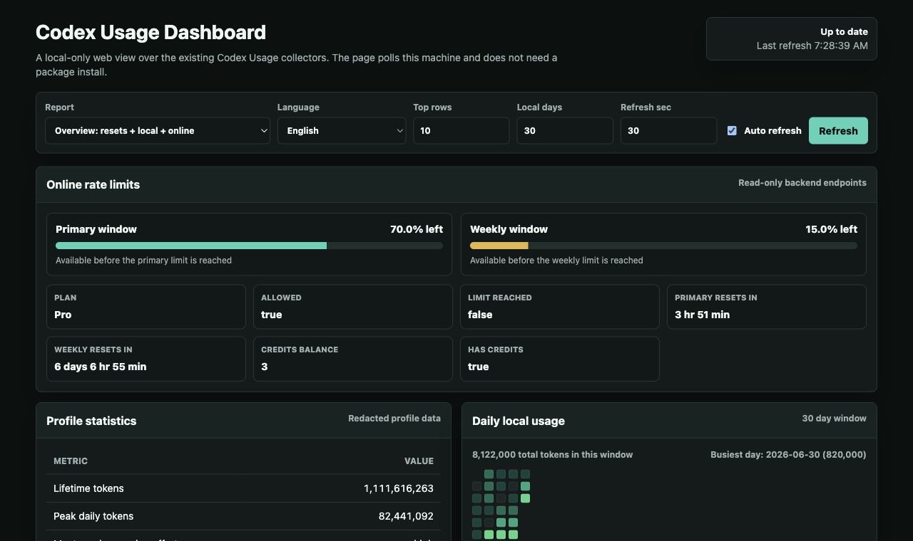
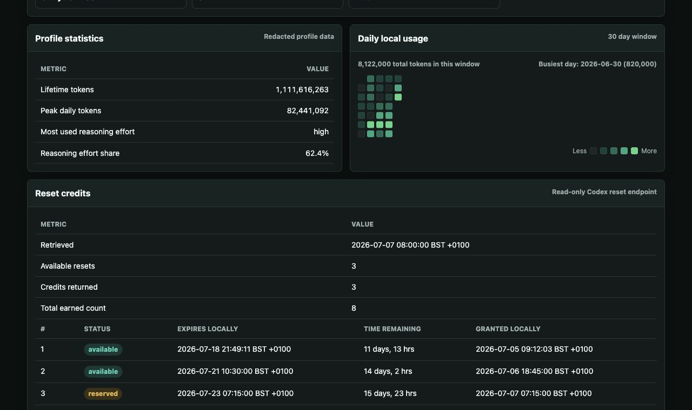
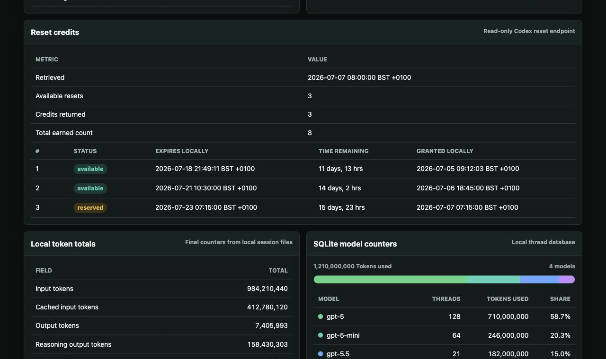
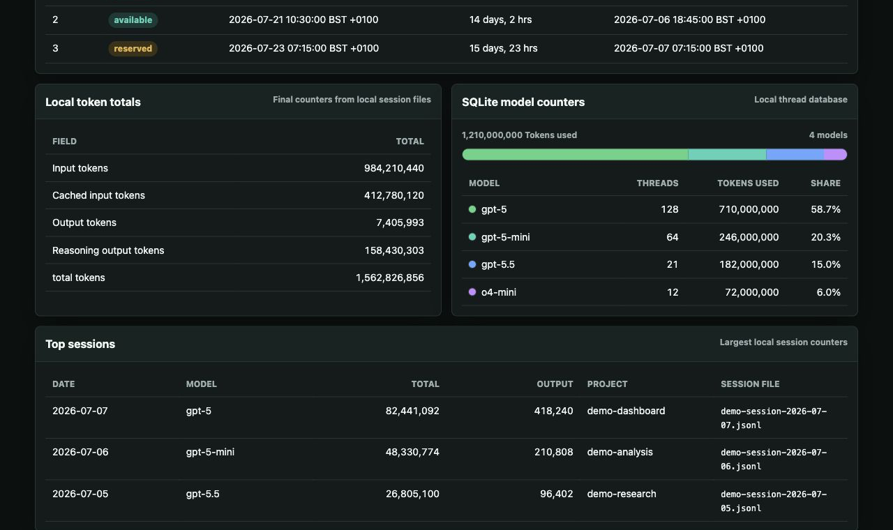
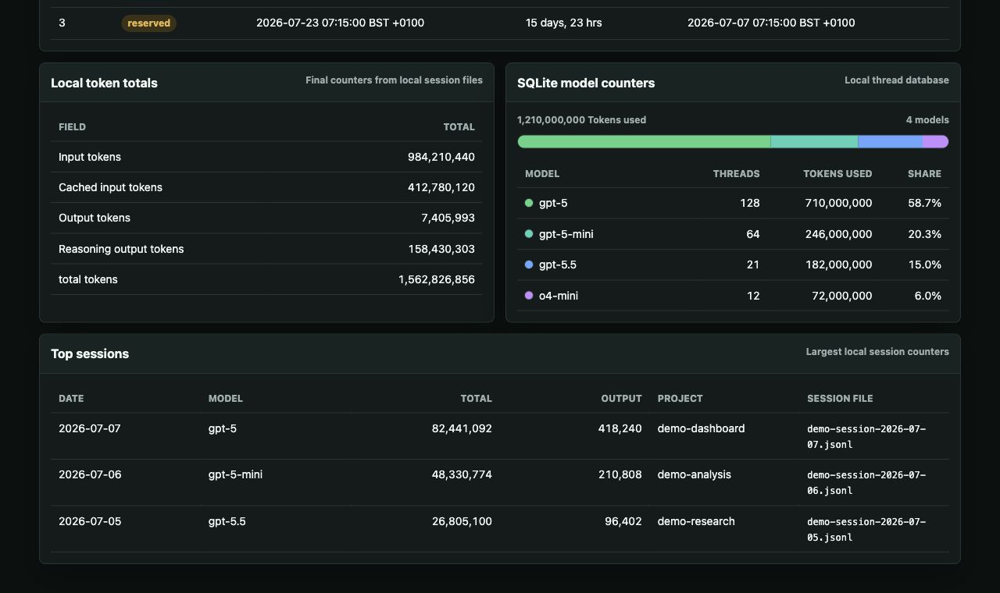
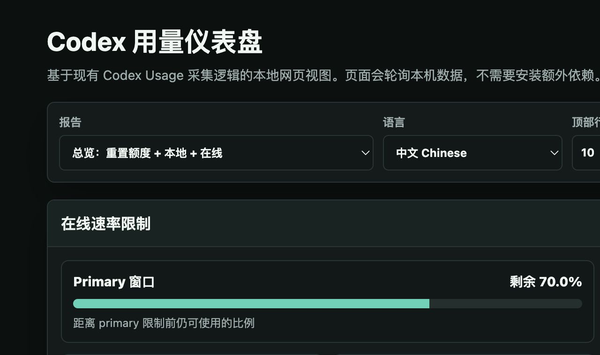

<p align="right">
  <a href="README.md">English</a> | <strong>中文</strong>
</p>

# Codex Usage

这是基于 [MacSteini/Codex-Usage](https://github.com/MacSteini/Codex-Usage)
的 fork，在原有命令行工具基础上新增了一个本地网页仪表盘，用来查看本机
Codex 用量信息，以及只读的 Codex/OpenAI 相关接口数据。

现在有两种使用方式：

- `codex_usage_web.py`：新增的本地深色网页仪表盘，支持自动刷新、中英文切换、
  rate-limit 进度条、每日用量热力图和模型用量图表。
- `codex_usage.py`：上游原始命令行工具，也是 CLI 和网页仪表盘共同使用的核心
  采集与报告实现。

不需要安装第三方 Python 包。项目只使用 Python 标准库。

> 这不是 OpenAI 或 Codex 的官方工具。它不会兑换额度、购买额度、修改你的账户、
> 修改 Codex 设置，也不会上传本地 transcript。

## 来源与署名

本仓库基于
[MacSteini/Codex-Usage](https://github.com/MacSteini/Codex-Usage)。核心实现是上游
`codex_usage.py` CLI，它负责采集并渲染 Codex 用量报告。原始 CLI 版本的项目说明
和完整使用指南保留在 [旧 README](README_OLD.md) 中。

这个 fork 的主要改动是在 `codex_usage_web.py` 中新增一个本地、可自动刷新的浏览器
仪表盘，并补充相关文档。原 CLI 仍然可用，并且仍然是网页仪表盘数据的基础。

上游项目使用 MIT License 分发。复制、修改或再分发本项目时，请保留 `LICENCE`
中的版权声明和许可条款。

## 功能

- 本地网页仪表盘：`http://127.0.0.1:8765`。
- 自动刷新用量视图，也可以手动刷新。
- English / 中文 Chinese 界面切换。
- Online rate-limit 视图显示 primary 和 weekly 的剩余百分比。
- reset 倒计时以天、小时、分钟显示。
- 类似 GitHub contributions 的每日本地用量热力图。
- SQLite model counter 堆叠条形图，以及带颜色标识的模型表格。
- 本地 token 总量和最高用量 session。
- 可选的 OpenAI Admin API 用量和成本视图，需要 `OPENAI_ADMIN_KEY`。
- 原始 CLI 报告和导出功能仍然保留；完整 CLI 指南见
  [README_OLD.md](README_OLD.md)。

## 运行要求

- Python 3.10 或更新版本。
- 本机 Codex 状态目录，通常是 `~/.codex`。
- 如果要查看 reset credits 和在线 usage/profile，需要 Codex home 目录里的
  `auth.json` 登录信息。
- 只有在查看可选的 OpenAI Admin API 用量/成本报告时，才需要 `OPENAI_ADMIN_KEY`。

默认情况下，工具从这里读取 Codex 数据：

```text
Path.home() / ".codex"
```

如果你的 Codex 数据在其他位置，可以设置 `CODEX_HOME`。

## 快速开始：网页仪表盘

在仓库目录中运行：

```sh
python3 codex_usage_web.py
```

然后打开：

```text
http://127.0.0.1:8765
```

在终端中按 `Ctrl-C` 可以停止服务。

如果端口 `8765` 已经被占用，可以换一个端口：

```sh
python3 codex_usage_web.py --port 8766
```

然后打开：

```text
http://127.0.0.1:8766
```

常用选项：

```sh
python3 codex_usage_web.py --refresh 30
python3 codex_usage_web.py --quiet
python3 codex_usage_web.py --host 127.0.0.1 --port 8765
```

仪表盘默认绑定到 `127.0.0.1`，所以它默认只用于本机查看。

## 原始 CLI

原始命令行工具仍然保留为 `codex_usage.py`，并且仍然是网页仪表盘使用的核心
采集/报告实现。CLI 安装、命令、导出、认证说明和故障排查，请看保留的
[旧 README](README_OLD.md)。

## 报告类型

| 报告 | Dashboard/API value | 网络请求 |
| --- | --- | --- |
| 总览 | `report=all` | 是 |
| Reset credits | `report=resets` | 是 |
| 本地用量 | `report=local-usage` | 否 |
| 在线用量/profile | `report=online-usage` | 是 |
| OpenAI API 用量/成本 | `report=api-usage` | 是，需要 `OPENAI_ADMIN_KEY` |

## Dashboard API

网页服务也提供本地 JSON 接口：

```text
GET /
GET /healthz
GET /api/usage
```

示例：

```text
http://127.0.0.1:8765/api/usage?report=local-usage&top=10&days=30
```

常用 query 参数：

| 参数 | 作用 | 默认值 |
| --- | --- | --- |
| `report` | `all`, `resets`, `local-usage`, `online-usage`, 或 `api-usage` | `all` |
| `top` | 返回多少条排行数据 | `10` |
| `days` | 最近多少天的本地每日窗口 | `30` |
| `warn_days` | reset 即将过期提示窗口 | `7` |
| `bucket_width` | API usage 桶宽：`1d`, `1h`, 或 `1m` | `1d` |
| `limit` | 可选的 API usage bucket 数量限制 | 空 |
| `group_by` | 可选 API usage 分组字段，可重复或用逗号分隔 | 空 |
| `no_costs` | 用 `1`, `true`, 或 `yes` 跳过 API costs 查询 | `false` |

## 截图

<!-- markdownlint-disable MD033 -- HTML is used here so GitHub can render bounded thumbnails that link to the full-size screenshots. -->
<p>
  <a href="img/dashboard/1.png"></a>
  <a href="img/dashboard/2.png"></a>
  <a href="img/dashboard/3.png"></a>
  <a href="img/dashboard/4.png"></a>
  <a href="img/dashboard/5.png"></a>
  <a href="img/dashboard/6.png"></a>
</p>
<!-- markdownlint-enable MD033 -->

## 文档

- [README.md](README.md)：英文版 README，也是 GitHub 默认显示的首页。
- [WEB_DASHBOARD.md](WEB_DASHBOARD.md)：本地网页仪表盘的详细说明。
- [README_OLD.md](README_OLD.md)：原 CLI 版本的长文档。

## 隐私与安全

- 本地仪表盘默认只从 `127.0.0.1` 提供服务。
- 本地用量从你机器上的 Codex 文件读取。
- Reset credits 和在线 usage/profile 报告使用只读的 Codex 后端请求。
- 可选的 `api-usage` 报告使用 OpenAI Admin API 官方接口。
- 不要提交 `OPENAI_ADMIN_KEY`、Codex `auth.json`、私有导出报告，或包含敏感账户
  信息的截图。

在线报告使用的 Codex 后端接口未公开文档，未来可能变化。请把输出当作有用的
运行状态信息，而不是正式账单。
