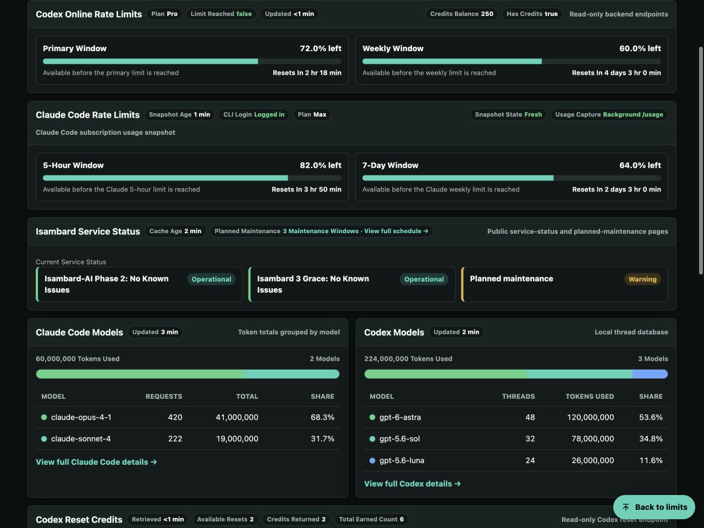
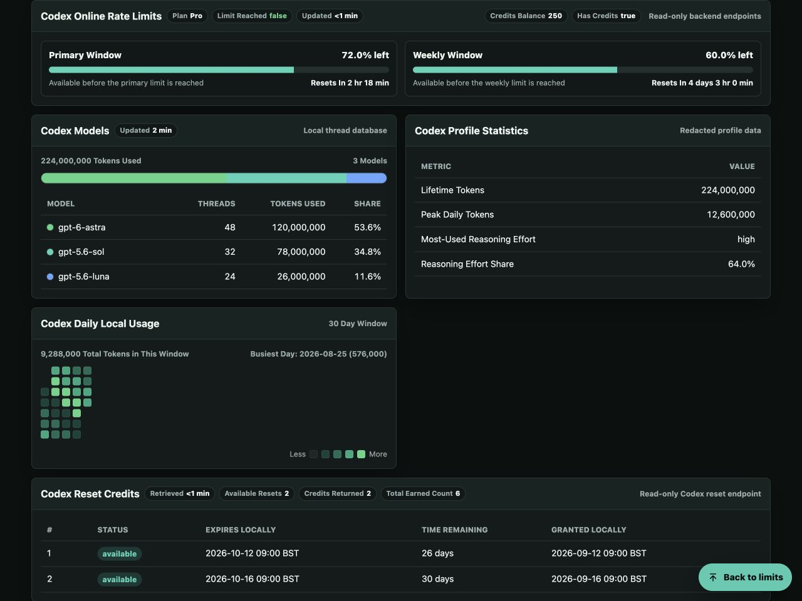
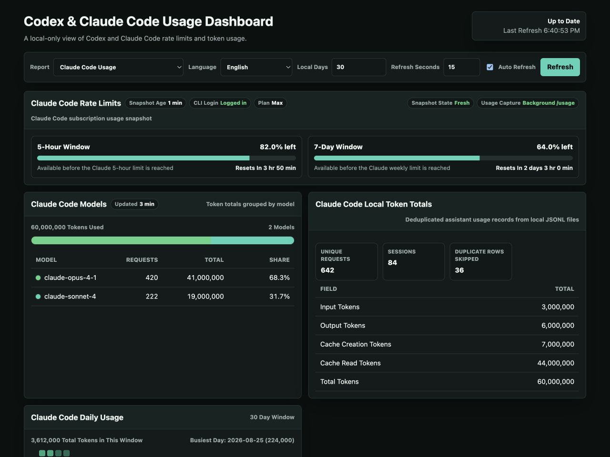
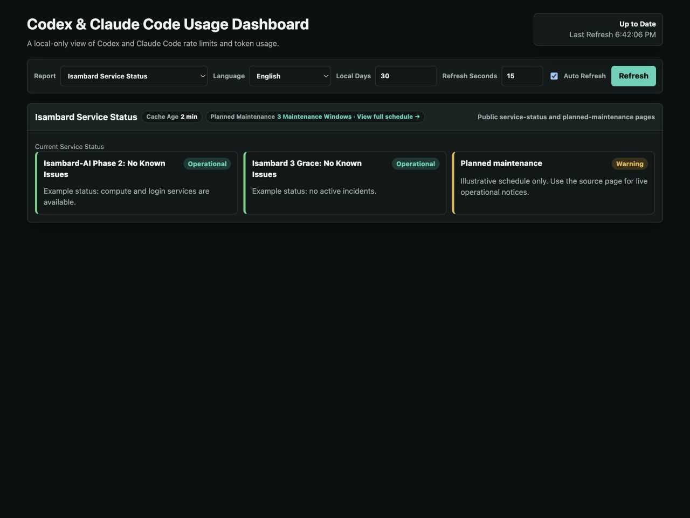
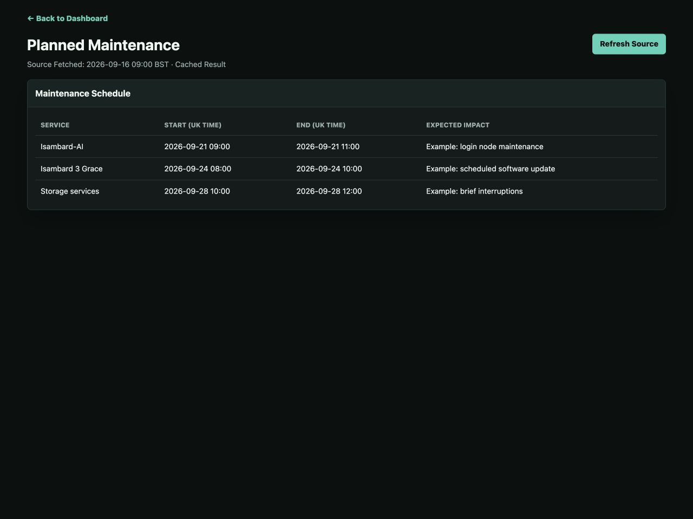
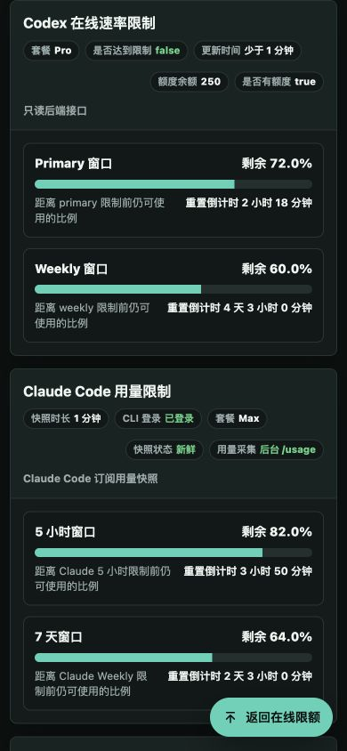
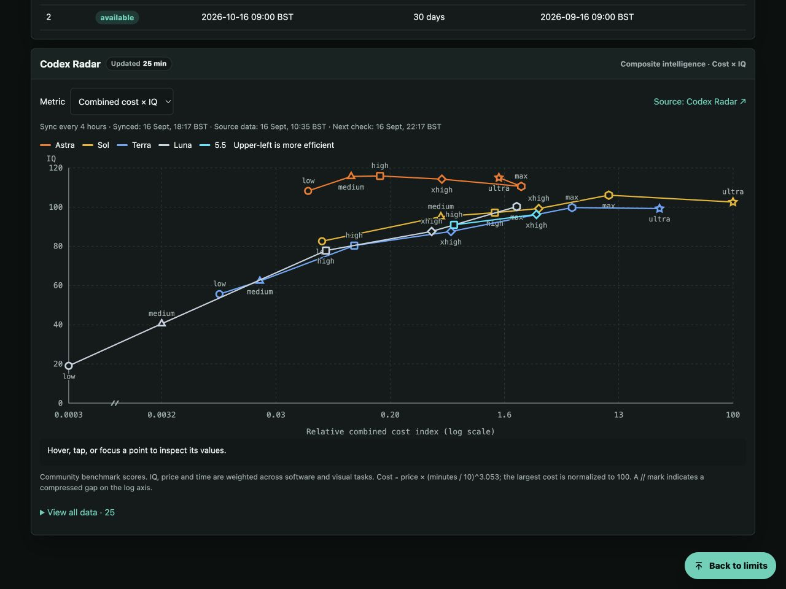
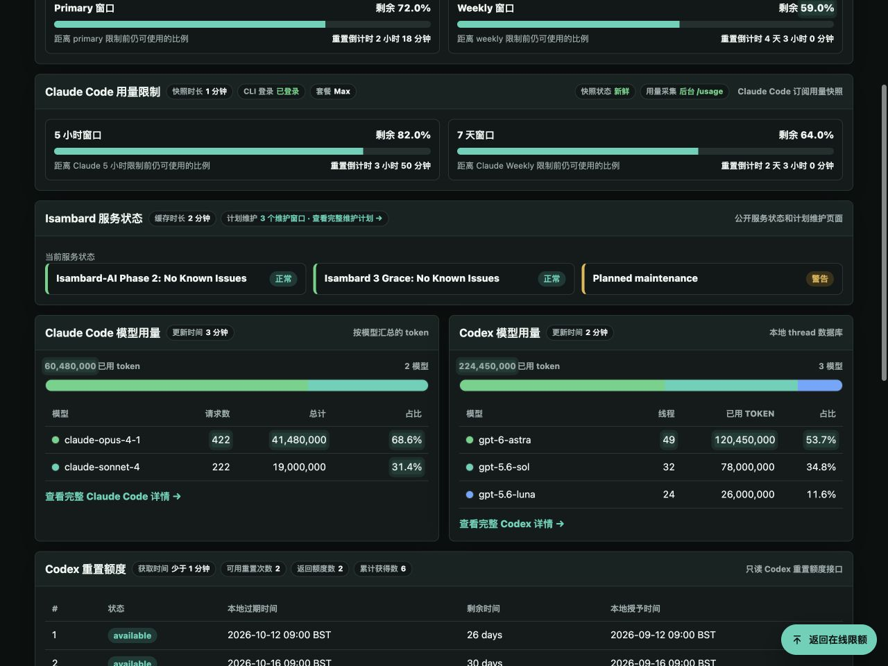

# Screenshots

[Quick start](../README.md)

Click a thumbnail to open the full-size image. Refreshed on **2026-09-16**,
these screenshots show the interface with illustrative usage, project,
and service-status data. The Radar chart uses a cached public benchmark snapshot.
They are feature examples, not live account usage, official ratings, or current
service-status reports.
The Radar screenshot predates the GPT-6/GPT-5 tabs, benchmark views, and GPT-6.1
score cards; see [Codex Radar benchmark curves](radar.md)
for the current behaviour.

<!-- markdownlint-disable MD033 -- HTML keeps the screenshot gallery compact on GitHub. -->

  
  
  
  
  
  
  
  

<!-- markdownlint-enable MD033 -->

Images 1–5: overview, Codex detail, Claude Code detail, Isambard status, and
maintenance. Image 6: mobile layout. Image 7: Radar curves. Image 8: model-value
change highlights (one frame of the animation).
